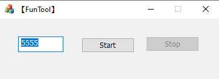

<h1 align="center">ChatGPT-WeChatBot</h1>

Using ChatGPT-WeChatBot based on ChatGPT(Non-API key call) and the official WeChat hook interface. 

English | [简体中文](https://github.com/LinkScapeFoundation/ChatGPT-WeChatBot/blob/master/Readme_CN.md)

<div align="center">  </div>

## Donate

https://bank.hackclub.com/donations/start/linkscape

[](https://bank.hackclub.com/donations/start/linkscape)

## Authors

[@SnapdragonLee](https://github.com/SnapdragonLee) (Co-founder of LinkScape Foundation)

[@thomaswcy](https://github.com/thomaswcy) (Founder of LinkScape Foundation)

*cover created from [DALL·E2 (OpenAI.com)](https://labs.openai.com/)*

## Support & Features

- [x] Supports conversations
- [x] Supports context-aware question answering
- [x] **Never get banned (by using the official WeChat execution)**
- [x] Set the keywords to wake up the WeChatBot in private chat
- [x] Set the keywords to wake up the WeChatBot in group chat
- [x] Support replying *at-message* when mentioning your bot in the group. **(have bugs)**
- [x] Get help doc in line
- [x] Set keywords to reset the previous conversation
- [x] Regenerate to get another answer
- [x] Rollback conversation

## Default configs (Follow these steps before you start the server, all configuration files are in `.config`)

```
{
  // Setting host running locally (only local)
  "server_host": "127.0.0.1:5555",

  // Whether to enable ChatGPT auto-reply function
  "autoReply": true,
  // Setting keyword to wake up bot in group chat
  "groupChatKey": "-c",
  // Using reply mode in group chat
  "grpReplyMode": false,
  // Origin question quote on head of answer in group chat
  "grpCitationMode": true,
  // Setting keyword to wake up bot in private chat
  "privateChatKey": "-c",
  // Using reply mode in private chat
  "prvReplyMode": true,
  // Origin question quote on head of answer in private chat
  "prvCitationMode": false,

  // View available command help
  "helpKey": "-h",
  // Setting keyword to reset context
  "resetChatKey": "-rs",
  // Setting keyword to regenerate previous answer
  "regenerateKey": "-rg",
  // Setting keyword to roll back to previous n questions
  "rollbackKey": "-rb"
}
```

## Step to Start

1. Install all packages listed in `requirements.txt` , use the command like:

   ```
   pip install -r ./requirements.txt
   ```

2. Download package from GitHub Releases.

3. Install `WeChat-3.6.0.18.exe` on your computer, **if your version is higher than 3.6.0.18, you can downgrade instantly.** Then get your account online. You can also download zip version of WeChat. **If you wanna dual-call WeChat, modify `./dual-start.bat` file guiding by annotation.**

4. Monitoring WeChat message by running a server. Here are two methods to achieve this, **please *choose 1 method*** :

   - Using injector named `DLLinjector_V1.0.3.exe`, then choose file named `3.6.0.18-0.0.0.008.dll` to inject.

     

   - Running `funtool_3.6.0.18-1.0.0013.exe` , and press `Start` .

     

5. The last step is fill json files listed in `.config/` . 

   - In `config.json` ,  you need to configure your custom options based on your preferences.

   - In `rev_config.json` , you need to fill your ChatGPT login information by *choosing 1 method*: 

     - Email/Password **(Not supported for Google/Microsoft accounts)**

     - session_token **(supported for Google/Microsoft accounts)**

       > 1. Go to [`chat.openai.com/chat`](https://chat.openai.com/chat) and log in or sign up.
       > 2. Press `F12` to open dev tools.
       > 3. Copy cookies as `__Secure-next-auth.session-token` .

6. Run `main.py` by using command:

   ```
   python main.py
   ```

   **Everything is ready, feel free to go online with your ChatGPT-WeChatBot !** 
   
   No limitation, No usage counting, and no payment needed.

## FAQ

1. How to get full responses? You can say "continue" in your language and ChatGPT will continue the response
2. Have problems? Feel free to create an issue

## Who has starred

[](https://github.com/LinkScapeFoundation/ChatGPT-WeChatBot/stargazers)

## Stargazers over time

[](https://starchart.cc/LinkScapeFoundation/ChatGPT-WeChatBot)

## Log

- 2023.03.04 Move GitHub repo to [@LinkScapeFoundation](https://github.com/LinkScapeFoundation) and fix mistakes in documentations
- 2023.02.27 Add zip version of WeChat and `dual-start.bat`,  fix the bug that prevents other operations when the response keyword is empty.
- 2023.02.25 Add the option in `config.json` to quote the original question before answering 
- 2023.02.25 Complete all API function on features and Debugs for errors
- 2023.02.23 Accomplish some API listed on features
- 2023.02.23 Fix streaming issue when connecting to reverse server
- 2023.02.21 Report issue on ChatGPT API
- 2023.02.20 v0.90-dev released, for basic ChatGPT API usage on WeChat
- 2023.02.17 Start to develop the whole process

## References

- [AutumnWhj/ChatGPT-wechat-bot: ChatGPT for wechat](https://github.com/AutumnWhj/ChatGPT-wechat-bot)
- [cixingguangming55555/wechat-bot: 带二次开发接口的PC微信聊天机器人](https://github.com/cixingguangming55555/wechat-bot)
